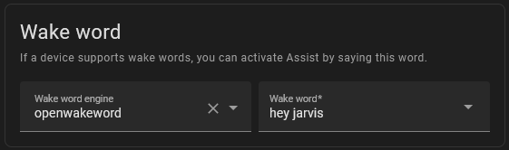
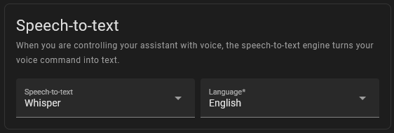
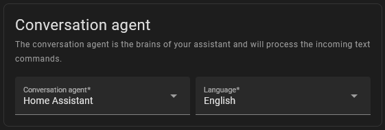
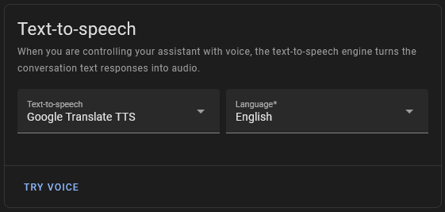

# Xiao ESP32S3 Sense HA Assist voice assistant 🎙️ with ESPHome

This is a collection of ESPHome project examples for creating a custom voice assistant using a Xiao ESP32S3 Sense board. Being the Xiao Sense board very capable I wanted to make a **Ultimate Room Sensor** with voice assistant and a bunch of other sensors. Here I try explain in great details how to setup everything you need to get everything working.

Comparing the Xiao Sense with others board specifically made for voice assistant, has only one microphone and it lacks of audio processing ICs which means that all processing is made by the esp32s3 which is not as efficient. But it's cheap and can do everything you need!

Video about this project is coming soon ...

You can find more about the Xiao ESP32S3 Sense in my other YouTube video here ⤵️

[](https://www.youtube.com/watch?v=_67m6rpgLw4)

## Requirements 📖

- Home Assistant 🏠
- ESPHome 📦⤵️

    [](https://my.home-assistant.io/redirect/supervisor_addon/?addon=5c53de3b_esphome&repository_url=https%3A%2F%2Fgithub.com%2Fesphome%2Fhome-assistant-addon)

## ESPHome Configs 📄

To use anyone of the examples below ⏬ you can simply **copy the contents of the config file** and replace everything inside your esphome config file.

### WiFi Setup

To setup wifi manually you have to uncomment the `wifi` segment from the config file like this:

`device-config.yaml`

```yaml
wifi:
  ssid: !secret wifi_ssid
  password: !secret wifi_password
```

and specify your wifi credentials in the `secrets` file:

`secrets.yaml`

```yaml
wifi_ssid: "your wifi name"
wifi_password: "your wifi password"
```

---

Now let's dive into all the configurations and see their advantages and their disadvantages.

### ✨ **Ultimate Room Sensor** ✨

Feature rich sensor, process the wake word on the esp32, cannot reproduce a response through a speaker. But has everything you need for a room sensor.

**Wake Word:** Micro Wake Word

**External Components:**

| Component | Description |
|------|------|
| LD2450 📡 | Radar sensor for presence detection |
| PIR 🏃🏻 | Passive infrared sensor for motion detection |
| DHT22 🌡️ | Temperature and humidity sensor |
| TSL2561 ☀️ | Illuminance sensor |

**Bluetooth proxy** for letting Home Assistant control bluetooth devices or scan for iBeacons

**Check out:**

- External components wiring --> [HERE](docs/ultimate-room-sensor/wiring.md)

- Configuration file --> [HERE](ultimate-room-sensor.yaml)

---

### ✨ **Assist with Media Player** ✨

Voice assistant device whith a microphone and speaker, the speaker can also be controlled by Home Assistant as a media player.
But the Micro Wake Word cannot be used with media player, so the wake word detection is performed by Home Assistant.

**Wake Word:** Home Assistant (openWakeWord addon)

**External Components:**

| Component | Description |
|------|------|
| PCM5102 🔊 | I2S DAC module for audio |

**Check out:**

- External components wiring --> [HERE](docs/assist-media-player/wiring.md)

- Configuration file --> [HERE](assist-media-player.yaml)

---

### ✨ **Assist with Speaker** ✨

Voice assistant device whith a microphone and speaker, the speaker is only used to play TTS responses.
Because the Micro Wake Word cannot be used with media player.

**Wake Word:** Micro Wake Word

**External Components:**

| Component | Description |
|------|------|
| PCM5102 🔊 | I2S DAC module for audio |

**Check out:**

- External components wiring --> [HERE](docs/assist-speaker/wiring.md)

- Configuration file --> [HERE](assist-speaker.yaml)

---

### ✨ **Simple Micro Wake Word** ✨

Simple voice assistant device without speaker which process wake word on device.

**Wake Word:** Micro Wake Word

**External Components:** None

**Check out:**

- Configuration file --> [HERE](assist-micro-wake-word.yaml)

---

### ✨ **Simple external Wake Word** ✨

Simple voice assistant device without speaker which requires Home Assistant to process the audio stream for wake word detection.

**Wake Word:** Home Assistant (openWakeWord addon)

**External Components:** None

**Check out:**

- Configuration file --> [HERE](assist-external-wake-word.yaml)

---

### ✨ **Simple Push to Talk** ✨

This is the most basic configuration, the voice assistant can only be activated by a Home Assistant button.

**Wake Word:** None

**External Components:** None

**Check out:**

- Configuration file --> [HERE](simple-assist-push-to-talk.yaml)

## Assist Pipeline 🔧

You can see all your configured Assist pipelines here ⤵️

[](https://my.home-assistant.io/redirect/voice_assistants/)

The Assist pipeline is made of:

- **Wake word** detection *(Optional)* --> Activates the Assist pipeline

    

    It can be processed by the *esp32* (with [Micro Wake Word](https://esphome.io/components/micro_wake_word.html)) or by *Home Assistant* (with the [openWakeWord](https://my.home-assistant.io/redirect/supervisor_addon?addon=core_openwakeword) Addon).

    If not set then the Assist pipeline can only be activated manually by a *push to talk button* or any other thing.

- **Speech to Text** engine *(Required)* --> Process the audio stream and turns your voice commands into text

    

    This a very heavy task and cannot be reliably computed on a Raspberry pi!

  - So you can run it in the cloud using [OpenAI Whisper](https://github.com/fabio-garavini/ha-openai-whisper-stt-api). ⤵️

    [](https://my.home-assistant.io/redirect/hacs_repository/?owner=fabio-garavini&repository=ha-openai-whisper-stt-api&category=integration)

  - Or if you have a powerful enough computer you can use the *Whisper* addon. ⤵️

    [](https://my.home-assistant.io/redirect/supervisor_addon/?addon=core_whisper)

- **Conversation agent**  *(Required)* --> Process the incoming text command

    

  - *Home Assistant* is the default built in agent
  - *OpenAI gpt* using the awsome [Extended OpenAI Conversation](https://github.com/jekalmin/extended_openai_conversation) custom component by [jekalmin](https://github.com/jekalmin). ⤵️

    [](https://my.home-assistant.io/redirect/hacs_repository/?owner=jekalmin&repository=extended_openai_conversation&category=integration)

- **Text to Speech** engine *(Optional)*

    

  - *Google Translate TTS* easy to run but low quality. ⤵️

    [](https://my.home-assistant.io/redirect/config_flow_start?domain=google_translate)

  - *Piper* is a opensource tts engine. ⤵️

    [](https://my.home-assistant.io/redirect/supervisor_addon/?addon=core_piper)
