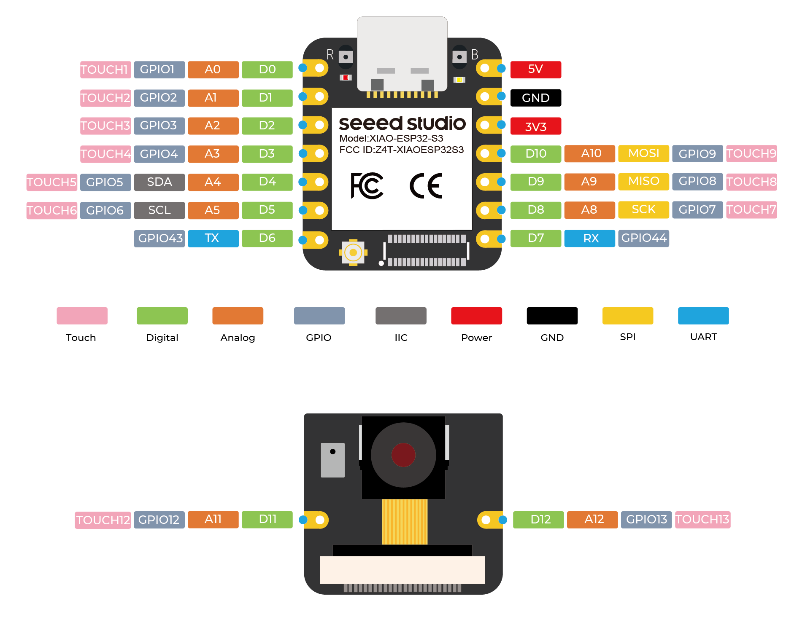
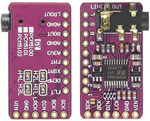
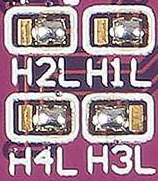

# Assist with Speaker - Wiring 🔌

Voice assistant device whith a microphone and speaker, the speaker is only used to play TTS responses.
Because the Micro Wake Word cannot be used with media player.

| Component | Description |
|------|------|
| Xiao ESP32S3 Sense 📟 | esp32 board |
| PCM5102 🔊 | I2S DAC module for audio |
| Speaker | speaker with audio jack input |

## Xiao ESP32S3 Sense 📟

## PCM5102 🔊

`# Pin Functions`

On the back of the board there are 4 pads which have to be bridged as follows

| Pin | State |
|------|------|
| 1 | Low (L) |
| 2 | Low (L) |
| 3 | High (H) |
| 4 | Low (L) |

`# Connections`
| PCM5102 | ESP32S3 |
|------|------|
| VCC | 5V |
| Data | D9 (GPIO8) |
| NC | (not connected) |
| GND | GND |

`# Speaker`

Now you can plug a speaker to the `LINE OUT` of the board
