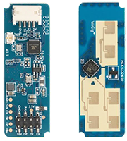
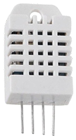
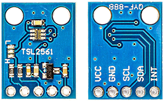

# Ultimate Room Sensor - Wiring 🔌

Feature rich sensor, process the wake word on the esp32 using Micro Wake Word, cannot reproduce a response through a speaker. But has everything you need for a room sensor.

| Component | Description |
|------|------|
| Xiao ESP32S3 Sense 📟 | esp32 board |
| LD2450 📡 | Radar sensor for presence detection |
| PIR 🏃🏻 | Passive infrared sensor for motion detection |
| DHT22 🌡️ | Temperature and humidity sensor |
| TSL2561 ☀️ | Illuminance sensor |

## Xiao ESP32S3 Sense 📟

## LD2450 📡

Radar sensor

`# Connections`
| LD2450 | ESP32S3 |
|------|------|
| 5V | 5V |
| GND | GND |
| TX | D7 (GPIO44) |
| RX | D6 (GPIO43) |

## PIR 🏃🏻

Passive Infrared sensor

`# Connections`
| PIR | ESP32S3 |
|------|------|
| VCC | 5V |
| OUT | D8 (GPIO7) |
| GND | GND |

## DHT22 🌡️

Digital temperature and humidity sensor

`# Connections`
| DHT22 | ESP32S3 |
|------|------|
| VCC | 5V |
| Data | D9 (GPIO8) |
| NC | (not connected) |
| GND | GND |

## TSL2561 ☀️

Illuminance sensor

`# Connections`
| TSL2561 | ESP32S3 |
|------|------|
| VCC | 5V |
| GND | GND |
| SCL | D5 (GPIO6) |
| SDA | D4 (GPIO5) |
| INT | (not connected) |
